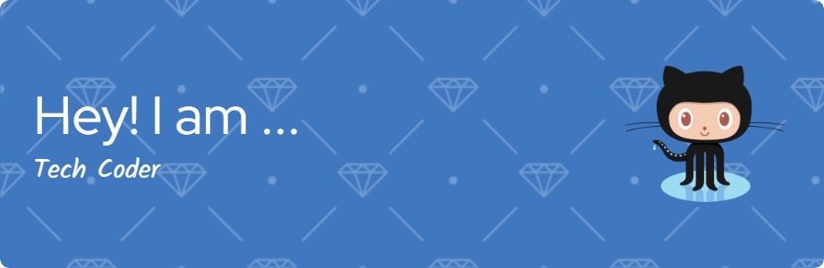

# 💫 About Me:
 hello programmers  I'm Tech Coder I am a student of software engineering

## 🌐 Socials Link:
  

# 💻 Language And Tools:
             	       

# 📊 GitHub Stats:
 
 

### ✍️ Random Dev Quote

### 😂 Random Dev Meme

  ## 💰 You can help me by Donating
   

  
<!-- Proudly created with GPRM ( https://gprm.itsvg.in ) -->
